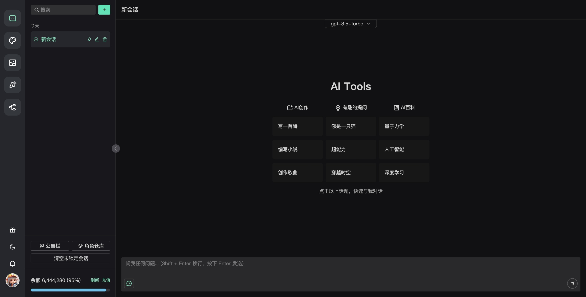
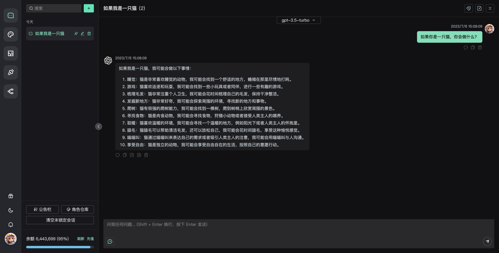
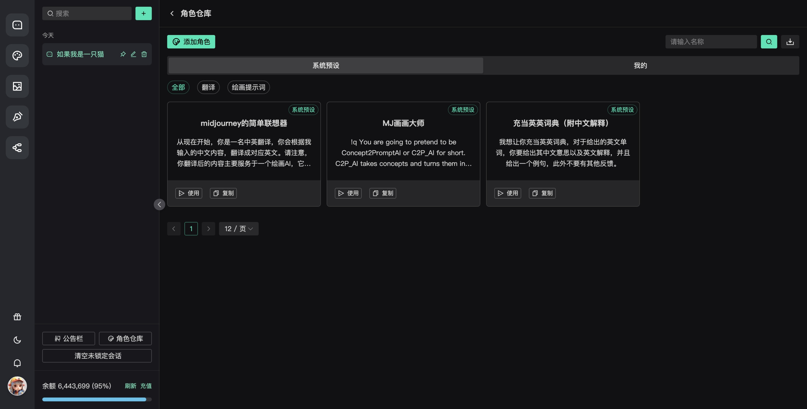

# chatgpt-web-plus

## 介绍

简介：

包含完整管理的 `chatgpt-web` 应用

- 个人部署
- 商业部署
- 企业部署
- 团队部署

预览：

> 服务速率有限，请有限访问，谢谢

[体验地址](http://chatgpt-web-plus.it007996.top/login?inviteCode=BNPW7BQHD)

联系：

[Q群:734133205](http://qm.qq.com/cgi-bin/qm/qr?_wv=1027&k=mj6rjqBvsNkT66LsQAfMBIqZl0Esjwn5&authKey=CQa4XIElV0DIhjIbIgfix1bUZW5wRNnEJeHo%2BEDloZOIcnXaTe%2Bbzvn0A42Wseq5&noverify=0&group_code=734133205)

## 预览

客户端

后台管理

## 功能
[✓] 登录、注册、用户管理

[✓] 服务端保存用户会话和聊天记录

[✓] `key` 轮询池

[✓] 用户额度管理

[✓] 用户消耗记录

[✓] 自定义回复内容

[✓] 自定义敏感词

[✗] more..

## 联系

QQ群号: [734133205](http://qm.qq.com/cgi-bin/qm/qr?_wv=1027&k=mj6rjqBvsNkT66LsQAfMBIqZl0Esjwn5&authKey=CQa4XIElV0DIhjIbIgfix1bUZW5wRNnEJeHo%2BEDloZOIcnXaTe%2Bbzvn0A42Wseq5&noverify=0&group_code=734133205)