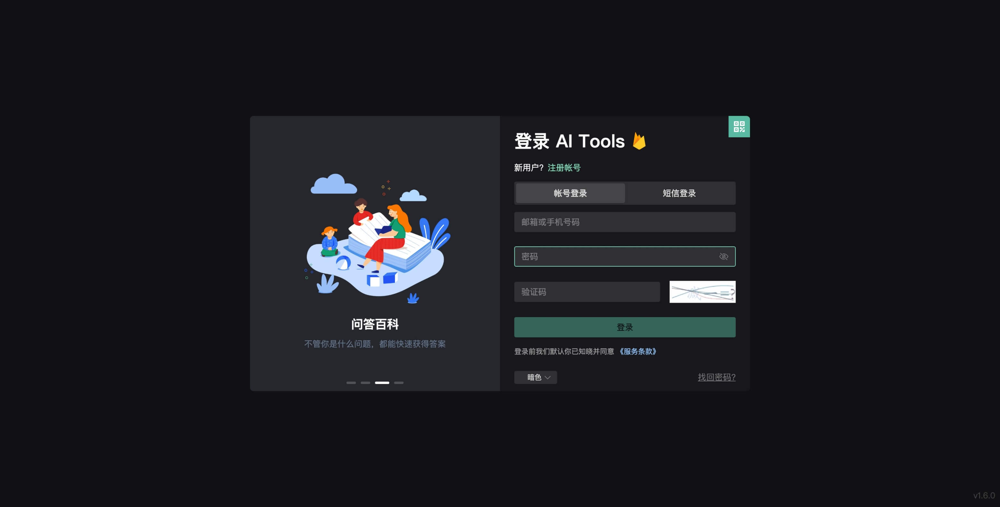
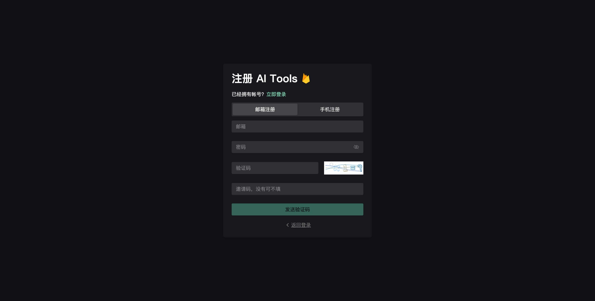
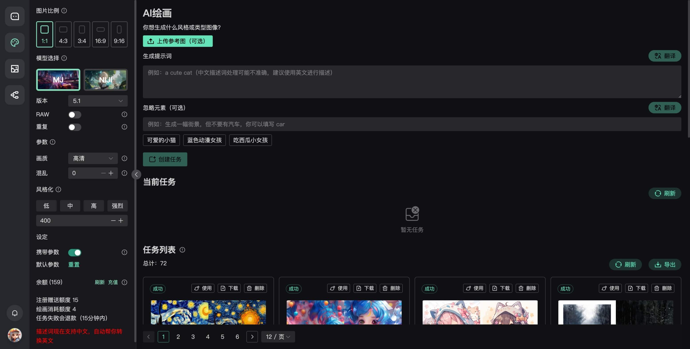
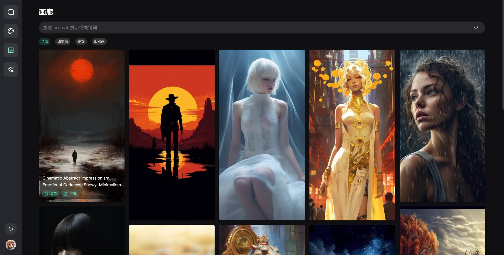
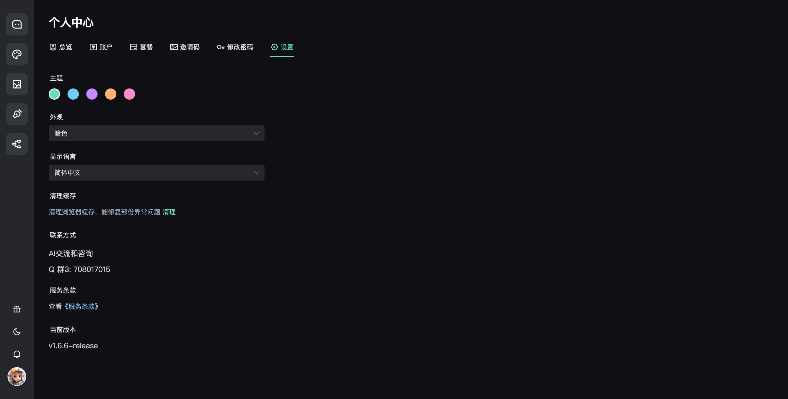

# chatgpt-web-plus

## 介绍

简介：

包含完整 `sass` 体验的 `chatgpt-web` 应用

## 功能

[✓] 登录、注册、用户管理

[✓] 微信登录

[✓] 邮箱、手机注册

[✓] 消息通知、公告

[✓] 卡密核销、站内支付、微信支付、支付宝支付、虎皮椒支付

[✓] 服务端保存用户会话和聊天记录

[✓] `key` 轮询池

[✓] 最新模型跟进

[✓] 用户额度管理

[✓] 用户消耗记录

[✓] 用户等级

[✓] 自定义回复内容

[✓] 联网查询

[✓] 自定义模型，如：claude-instant-1、百度、阿里、讯飞大模型等

[✓] 自定义敏感词，百度敏感词

[✓] 单点登录

[✓] 主题颜色

[✓] PDF 解析

[✓] AI 绘画（单独付费模块）

[✓] 画廊

[✓] 写作

[✓] 思维导图

[✓] 签到

[✗] more..

预览：

> 服务速率有限，请有限访问，谢谢

未收到注册邮件，可能是发送拥堵或检查你的邮箱-垃圾箱

[体验地址](https://chatgpt-web-plus.it007996.top/auth/register?inviteCode=BNPW7BQHD)

联系：

Q 群 1：734133205（可能满）

Q 群 2：777391456（可能满）

Q 群 3：708017015（可能满）

## 预览

预览图与实际更新效果可能存在差异，请以最新版本为准。

## 封面

### 桌面

### 移动

  

  

  

  

  

## 细节

客户端

后台管理

