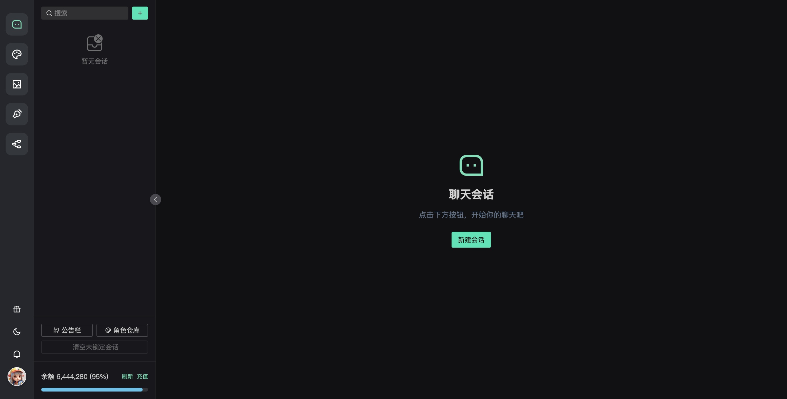
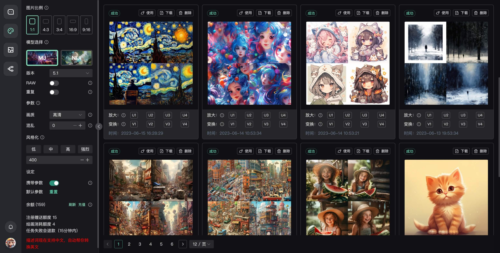
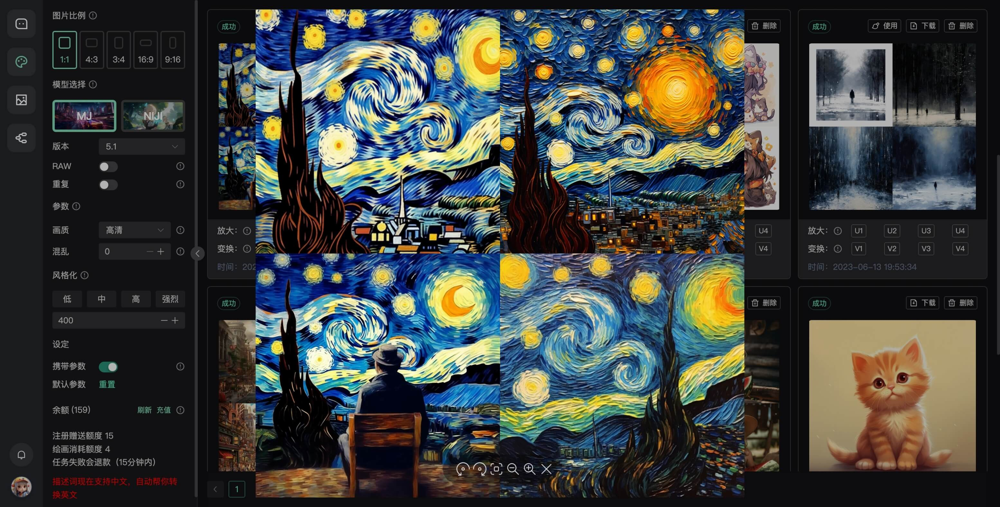

# chatgpt-web-plus

## 介绍

简介：

包含完整管理的 `chatgpt-web` 应用

## 功能
[✓] 登录、注册、用户管理

[✓] 服务端保存用户会话和聊天记录

[✓] `key` 轮询池

[✓] 用户额度管理

[✓] 用户消耗记录

[✓] 自定义回复内容

[✓] 自定义敏感词

[✓] 单点登录

[✓] AI绘画

[✗] more..

预览：

> 服务速率有限，请有限访问，谢谢

未收到注册邮件，可能是发送拥堵或检查你的邮箱-垃圾箱
  
[体验地址](http://chatgpt-web-plus.it007996.top/login?inviteCode=BNPW7BQHD)

联系：

Q群1：734133205（可能满）

Q群2：777391456

## 预览

预览图与实际更新效果可能存在差异，请以最新版本为准。

客户端

后台管理

